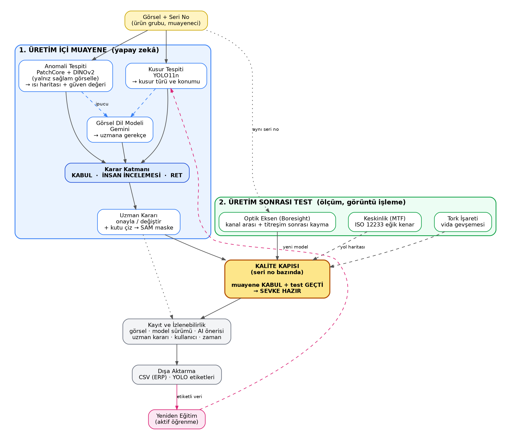

# 3E Elektro Optik — AI Destekli Görsel Kalite Kontrol Sistemi (PoC)




[](https://huggingface.co/spaces/ugurhandasdemir/3e-vaka-calisma)
[](https://github.com/Ugurhandasdemir/3e-vaka-calisma)
[](docs/teknik-dokuman.pdf)

Bu proje, **3E Elektro Optik** elektro-optik ve elektro-mekanik ürün gruplarının (optik lens grupları, termal kamera modülleri, elektro-optik gözetleme sistemleri) üretim ve montaj hatlarında kullanılmak üzere geliştirilmiş yapay zeka destekli bir **görsel kalite kontrol (Visual Quality Control - QC) prototipidir (PoC)**.

Sistem; muayene uzmanının yerini almak yerine operatörü hızlandırmak, insan yorgunluğundan kaynaklanan gözden kaçırmaları engellemek ve AS9100 standartlarında denetlenebilir bir kalite kontrol kaydı oluşturmak üzere **insan-döngüde (human-in-the-loop)** hibrit karar destek mekanizması sunar.

**Canlı bağlantılar:** [qc.ugurhandasdemir.com](https://qc.ugurhandasdemir.com) (ana) · [Hugging Face Space](https://huggingface.co/spaces/ugurhandasdemir/3e-vaka-calisma) (yedek) · [GitHub](https://github.com/Ugurhandasdemir/3e-vaka-calisma)

Çıkarım CPU üzerinde çalışır. Ana adres Dockerfile ile kendi sunucusunda yayınlanır (`Dockerfile`, port 7860); Hugging Face Space aynı kodun yedeğidir.

---

## 🏭 İki Aşamalı Üretim ve Kalite Kapısı Mimarisi

Sistem, parça seri numaralarını ve denetim kayıtlarını ortak paylaşan iki temel üretim aşaması ve birleşik kalite kapısından oluşur:

1. **🏭 1. Aşama — Üretim İçi Muayene:**
   - **Anomali (topluluk):** PatchCore-WRN50 + AnomalyDINO (DINOv2 ViT-S/14). "Önce birleştir, sonra kalibre et": birleşik skor, kategori başına 40 sağlam kalibrasyon görseliyle conformal $p$-değerine çevrilir.
   - **Kusur dedektörü:** YOLO11n (mAP50 0,814; uygulama kategorilerinde 0,779).
   - **VLM:** Gemini 3.5 Flash-Lite (yedek 3.8 Flash / 3.1 Flash-Lite); ısı haritası ve kutu ipuçlarıyla, 3 örnekleme ve tutarlılık kontrolüyle.
   - **Füzyon:** KABUL / İNSAN İNCELEMESİ / RET; termal modül için ek risk kuralı.
   - **Operatör etiketleme:** kutu çizimi + MobileSAM maskeleri, YOLO detect/segment dışa aktarımı.
2. **🧪 2. Aşama — Üretim Sonrası Test:**
   - **Boresight:** OpenCV alt-piksel retikül (sentetik hedeflerde en fazla 0,06 px hata), kanal arası hizalama, titreşim öncesi/sonrası kayma.
   - **MTF:** ISO 12233 eğik kenar; MTF50 hatası görünür kanalda %1,5, termalde %1,9.
   - **Tork işareti:** boya çizgisi açı farkı; 19/19 doğru karar, en büyük açı hatası 1,34°.
3. **🚦 Kalite Kapısı (Quality Gate):**
   - Parça seri numarası bazında izlenir: Yalnızca görsel muayene insan kararı **KABUL** (ACCEPT) ve son test **GEÇTİ** (PASS) olduğunda (ve titreşim kayması tolerans içindeyse) **SEVKE HAZIR** (🟢) statüsü verilir; aşamalardan biri eksikse **BEKLEMEDE** (🟡), herhangi bir aşama başarısızsa **RET** (🔴) verilir.

---

## ⚡ Değerlendirme için Hızlı Deneme

Sistemi 1 dakikada canlı olarak test etmek için:
1. [Hugging Face Spaces Canlı Demosunu](https://huggingface.co/spaces/ugurhandasdemir/3e-vaka-calisma) açın.
2. Örnek galerisinden hazır bir parça görseli seçin (ör. *Optik lens grubu* veya *Termal kamera modülü*).
3. **"Parçayı Analiz Et"** butonuna basın.
4. Çıkan yapay zeka önerisini ve motor analizlerini inceleyip nihai kararınızı (Kabul / Ret / İnceleme) seçin.
5. **"Kararı Kaydet"** butonuna basarak muayeneyi veritabanına işleyin.
6. **"Geçmiş ve Pano"** sekmesine geçerek kaydedilen denetim izini ve istatistikleri görüntüleyin.

---

## 🚀 Canlı Demo Akışı (5 Dakikalık Sunum Senaryosu)

1. **Sağlam Numune Analizi (KABUL):**
   - Sol panelden *Optik lens grubu* seçilir ve örnek galerisinden sağlam bir lens görseli yüklenir.
   - **"Parçayı Analiz Et"** butonuna basılır.
   - Anomali motoru $p$-değerini yüksek ($p > 0.50$) hesaplar, YOLO dedektörü kusur bulamaz.
   - **Erken çıkış (Early exit)** tetiklenerek VLM çağrılmadan **KABUL ÖNERİSİ** üretilir.
2. **Kusurlu Numune Analizi (RET):**
   - Galeriden çizikli veya montaj kusurlu bir görsel seçilir.
   - Anomali motoru belirgin ısı haritası üretir; YOLO dedektörü kusuru sınırlar ve sınıflandırır; Gemini VLM kusurun türünü ve neden kabul edilemeyeceğini Türkçe muhakeme ile raporlar.
   - Sistem **RET ÖNERİSİ** üretir, sağ panelde anomali ısı haritası ve tespit kutusu yan yana görüntülenir.
3. **Sınır Durum ve Yüksek Risk Koruması (İNSAN İNCELEMESİ - REVIEW):**
   - Motorlar arasında çelişki olan veya geçmişte geri çağırma riski bulunan yüksek riskli parça grubunda (*Termal kamera modülü*) bir numune analiz edilir.
   - Yüksek riskli termal grup **asla erken çıkış almaz**, tüm motorlar zorunlu koşturulur.
   - Sistem **İNSAN İNCELEMESİ** önerir. Arayüz doğrudan "AI önerisini onayla" seçeneğini kapatarak operatörü fiziksel inceleme sonucuna göre doğrudan **Kabul** veya **Ret** seçmeye yönlendirir.
4. **Kayıt ve Aktif Öğrenme (Geçmiş ve Pano):**
   - Operatör nihai kararını veritabanına kaydeder.
   - **"Geçmiş ve Pano"** sekmesine geçilerek AI-insan uyum oranı, insan incelemesine düşme yüzdesi ve kusur dağılımı incelenir.
   - **"YOLO Etiket Paketini İndir"** butonuyla aktif öğrenme döngüsünü besleyecek veri seti dışa aktarılır.

---

## 📏 Ölçülen Başarım

365 gerçek MVTec test görseli üzerinde:
- Topluluk anomali motoru: test AUROC **0,995**; $p \le 0{,}05$ eşiğinde kusur yakalama **%92,9**, yanlış alarm **%0**.
- Uçtan uca (anomali + YOLO), test bölümü: **0 kaçan kusur, 0 yanlış ret, %20,2 insan incelemesi**.

Ayrıntılar: `eval_results/RAPOR.md` ve `eval_results/BIRLESTIRME.md`. Değerlendirme kodu: `eval/`.

---

## 🏗️ Akış Özeti

```text
Görsel ─► Anomali (PatchCore + AnomalyDINO, conformal p) ─┐
      └─► Dedektör (YOLO11n) ───────────────────────────┤
                                                         ├─► Erken çıkış (sağlam & termal değil) ─► KABUL
                                                         ▼
                                              VLM (Gemini, 3 örnekleme)
                                                         ▼
                                   Füzyon: KABUL / İNSAN İNCELEMESİ / RET
                                                         ▼
                                     Operatör kararı ─► SQLite ─► CSV, YOLO ZIP
```

---

## 💻 Teknoloji Yığını

- **Arayüz:** Gradio 6.
- **Anomali:** PatchCore (`wide_resnet50_2`) + AnomalyDINO (DINOv2 ViT-S/14), conformal kalibrasyon (`calib.py`). EfficientAD ONNX yalnızca `models/anomaly_<kategori>.onnx` dosyası varsa kullanılır; depoda böyle bir model gönderilmez.
- **Dedektör:** YOLO11n (`notebooks/02_yolo11n.ipynb`), mAP50 0,814 (uygulama kategorilerinde 0,779).
- **VLM:** Gemini 3.5 Flash-Lite, yedek 3.8 Flash ve 3.1 Flash-Lite; yapılandırılmış JSON çıktısı.
- **Etiketleme:** MobileSAM (`engines/sam.py`).
- **Ölçüm:** `engines/boresight.py`, `engines/mtf.py`, `engines/torque_mark.py`.
- **Depolama:** SQLite (`data/qc.db`), CSV denetim izi, YOLO ZIP.
- **Ürün grupları (MVTec eşleşmesi):** Optik lens grubu → `metal_nut`; Termal kamera modülü → `transistor` (yüksek risk); Gözetleme ünitesi → `cable`.

---

## 📁 Proje Yapısı

```text
3e-vaka-calisma/
├── app.py                 # Gradio arayüzü
├── config.py              # Eşikler, kategoriler, sabitler
├── pipeline.py            # Muayene akışı
├── fusion.py              # Karar füzyonu
├── calib.py               # Conformal kalibrasyon
├── storage.py             # SQLite ve dışa aktarım
├── engines/
│   ├── anomaly.py         # PatchCore + AnomalyDINO
│   ├── detector.py        # YOLO11n
│   ├── vlm.py             # Gemini istemcisi
│   ├── sam.py             # MobileSAM
│   ├── boresight.py       # Alt-piksel retikül, kanal hizası, drift
│   ├── mtf.py             # ISO 12233 eğik kenar MTF
│   └── torque_mark.py     # Tork işareti denetimi
├── eval/                  # Değerlendirme betikleri
├── eval_results/          # RAPOR.md, BIRLESTIRME.md, split.json
├── models/                # YOLO ve kalibrasyon dosyaları
├── notebooks/             # Eğitim not defterleri
├── docs/                  # teknik-dokuman, CONTRACT.md
├── samples/               # Örnek görseller
├── test_gorselleri/       # Değerlendirme için hazır test görselleri (+ BENIOKU.md)
├── Dockerfile             # Ana adresin dağıtımı
└── tests/
```

`test_gorselleri/` içinde 3 ürün grubu için sağlam/kusurlu muayene görselleri ve boresight, MTF, tork işareti örnekleri vardır. Beklenen sonuçlar `test_gorselleri/BENIOKU.md` dosyasındadır. Uygulamanın Hakkında sekmesinden ZIP olarak da indirilebilir.

---

## 🔧 Yerel Kurulum ve Çalıştırma

### 1. Depoyu Klonlayın ve Sanal Ortamı Hazırlayın
```bash
git clone https://github.com/Ugurhandasdemir/3e-vaka-calisma.git
cd 3e-vaka-calisma

python3 -m venv .venv
source .venv/bin/activate
pip install -r requirements.txt
```

### 2. Ortam Değişkenlerini Tanımlayın
`.env.example` dosyasını `.env` olarak kopyalayın ve Gemini API anahtarınızı girin:
```bash
cp .env.example .env
# .env dosyasını düzenleyin:
# GEMINI_API_KEY=AIzaSy...
# GEMINI_MODEL=gemini-3.5-flash-lite
```

### 3. Uygulamayı Başlatın
```bash
python app.py
```
Uygulama yerel ağınızda `http://0.0.0.0:7860` adresinde sunulacaktır.

---

## 📂 `models/` Klasörü

- `models/calib_<kategori>.npy`: Kalibrasyon skorları.
- `models/yolo.onnx`: Eğitilmiş YOLO11n modeli. Yoksa dedektör devre dışı kalır, ağırlık diğer motorlara dağılır.
- `models/anomaly_<kategori>.onnx` (isteğe bağlı): EfficientAD ONNX modeli; yalnızca dosya varsa kullanılır.

---

## 🔄 Aktif Öğrenme (Active Learning) Döngüsü

Kalite kontrol sistemlerinin üretim hattında zamanla olgunlaşması için aktif öğrenme döngüsü entegre edilmiştir:

1. **Geri Bildirim Toplama:** Operatör tarafından **RET** kararı verilen ve tespit kutusu içeren numuneler SQLite veritabanında işaretlenir.
2. **Paketleme:** Pano sekmesindeki **"YOLO Etiket Paketini İndir (ZIP)"** butonu, bu hatalı numunelerin görsellerini, `classes.txt` sınıf fihristini ve normalize edilmiş YOLO koordinat etiketlerini ZIP arşivi olarak sunar.
3. **Yeniden Eğitim:** İndirilen ZIP paketi, Colab notebook'una (`notebooks/02_yolo11n.ipynb`) veya yerel eğitim hattına beslenerek dedektörün zayıf olduğu köşe durumlar (edge-cases) hızla modele kazandırılır.

---

## 🔒 Güvenlik ve Uyumluluk Notları

- **API Anahtarı Güvenliği:** Google Gemini API anahtarı repoda asla tutulmaz; yerel `.env` veya HF Spaces Secrets üzerinden yüklenir.
- **Girdi Doğrulama:** Yüklenen görseller bellek taşmalarına ve zararlı dosyalara karşı doğrulanır (Maks. 10 MB, RGBA/CMYK formatından RGB'ye dönüştürme, en uzun kenarı 1024 piksele ölçekleme).
- **EXIF Temizliği:** Yüklenen görseller bellekte PIL ile yeniden kodlanarak cihaz/konum üstverileri (EXIF) temizlenir.
- **Kuyruk ve Hız Sınırı:** Gradio kuyruğu (`concurrency_limit=2`) ile API kotası ve sunucu kaynakları korunur.
- **Savunma Sanayii / On-Prem Tavsiyesi:** PoC sürümünde VLM çağrıları bulut API üzerinden yapılmaktadır. Askeri ve savunma sanayii standartlarında (AS9100) üretim hattı için kapalı devre (on-prem) yerel VLM (Qwen2.5-VL vb.) ve yerel GPU kümesi kullanılmalıdır.

---

## ⚠️ Sınırlılıklar

- **Temsili veri:** MVTec AD (`metal_nut`, `transistor`, `cable`); gerçek 3E parça verisi kullanılmamıştır.
- **İyimser sonuç riski:** YOLO, MVTec test görsellerinin bir kısmıyla eğitilmiştir; uçtan uca sonuçlar bu nedenle iyimser olabilir.
- **Kayıt eksiği:** MTF ve tork işareti sonuçları henüz veritabanına kaydedilmiyor.
- **Bulut çağrısı:** PoC'de görseller Google API'ye gider; üretimde kapalı devre (on-prem) çalışılmalıdır.
- **Geçici disk:** Hugging Face Space'te disk kalıcı değildir; açılışta temsili geçmiş veriler yüklenir.

---

## 📄 Veri Lisansı ve Atıf

Bu projede kullanılan temsili endüstriyel numuneler **MVTec AD** veri kümesinden derlenmiştir:
- **Kaynak:** MVTec Software GmbH, *MVTec Anomaly Detection Dataset (MVTec AD)*, Bergmann et al., CVPR 2019.
- **Lisans:** [Creative Commons Attribution-NonCommercial-ShareAlike 4.0 International (CC BY-NC-SA 4.0)](https://creativecommons.org/licenses/by-nc-sa/4.0/).
- Yalnızca araştırma, eğitim ve kavram kanıtlama (PoC) amacıyla temsili parça olarak kullanılmıştır.

